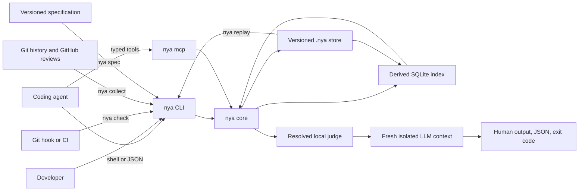

# Not You Again Architecture

## Status

This document defines the current runtime architecture. Source gates enforce
500 production lines and at least 95 percent line coverage.

## Purpose

Not You Again is a repository-local scar runtime for coding agents.

It gives every agent working in a repository the same durable record of real
mistakes, their corrections, and their provenance. Before a task, the agent
recalls relevant scars. Before completion, a fresh isolated judge audits the
task diff against those scars. Mature repositories can first recover
evidence-backed scars from Git history and corrected GitHub reviews. Proposed
specifications can be checked for omitted scar requirements, and historical
correction pairs can be replayed to audit the scar corpus itself.

## Public contract

The public model contains one concept:

> A scar is a durable lesson created from a real failure and correction.

The public surface contains six operations:

```text
A repository is adopting NYA       -> nya collect
A task is starting                 -> nya recall
A specification is being reviewed -> nya spec
A real correction happened        -> nya remember
Work is about to finish            -> nya check
The scar corpus is being audited   -> nya replay
```

The daily task protocol remains `recall`, `remember`, and `check`. Collection is
the historical adoption operation. Specification review is used only when a
versioned specification exists. Replay is an explicit corpus maintenance and
evaluation operation.

## System shape



Version 1.1 is one native Rust binary with one core and two transports.
The CLI serves humans, shell-capable agents, hooks, and CI. `nya mcp` serves
MCP-capable hosts over local stdio.

There is no daemon, hosted service, provider SDK, plugin runtime, or second data
path.

## Repository surface

Consumer repositories commit:

```text
.nya/
  .gitignore
  config.toml
  SKILL.md
  scars/
    NYA-01J2M6Y7R2W8Y0F7K5Q3C9A1B4.toml
```

Each scar is a readable TOML file. Git is the durable source of truth.

The derived database lives at:

```text
.nya/index-v1.sqlite3
```

It contains an FTS5 projection of searchable scar fields and the local
collector checkpoint. Complete scars and occurrences remain only in the
versioned TOML files. Missing, corrupt, or incompatible indexes rebuild
automatically. Losing the checkpoint causes an idempotent rescan, not data loss.

## Configuration boundary

The committed `.nya/config.toml` defines shared check policy. It never selects
a provider, model, credential, or executable.

Each developer selects one isolated evaluator once with:

```bash
nya setup --judge codex
```

The resulting user configuration is stored in the operating system
configuration directory. A repository may optionally override that choice with
an ignored `.nya/config.local.toml`, created by:

```bash
nya setup --local --judge claude
```

Resolution is strict and deterministic. Repository-local configuration wins
over user configuration. Missing or invalid configuration fails closed. The
agent never chooses a provider itself.

## Recall

Recall is deterministic and model-free.

Ranking uses:

1. Exact scope matches.
2. FTS5 relevance across task text, title, lesson, tags, and scope.
3. Independent occurrence count.

The requested limit bounds the complete ranked result, including exact scope
matches. This keeps interactive recall concise even in repositories with broad
or overlapping scopes.

## Remember

`nya remember` creates a scar or appends an occurrence to an explicitly selected
or exact normalized title match.

Every new scar requires at least one valid path glob. A truly repository-wide
scar uses the explicit `**` glob. Missing scopes fail closed rather than
falling back to relevance search.

Every occurrence preserves reporter, corrector, recorder, represented actor,
source, commit, and time when available. The system never invents a reporter.

For a line-level GitHub pull request review, `--github-review` verifies the
permalink through the authenticated `gh` CLI and derives the canonical source,
reporter, and occurrence time. The review body does not enter the scar or the
agent prompt. The correcting actor still states the title and lesson
explicitly.

Fuzzy similarity never merges scars automatically.

## Collect

`nya collect` is a retrospective evidence miner, not a code reviewer.

The deterministic discovery stage scans correction-shaped commits and
line-level GitHub review comments. A GitHub comment is eligible only when its
reviewed commit is an ancestor of `HEAD` and a later in-range commit changed the
same path.

Evidence is classified in bounded batches:

```text
source discovery
    -> failure and correction pairing
    -> relevant scar retrieval
    -> new, recurrence, skip, or ambiguous
    -> independent confirmation
    -> versioned write
```

Every accepted candidate needs verbatim source evidence, a concrete correction,
and a reusable lesson. A recurrence must reference one supplied scar. A new
candidate must provide a complete title, lesson, nonempty scopes, and tags. Confirmation
may only return an unchanged proposal.

`nya collect --all` scans reachable history. Incremental `nya collect` starts
after the ignored SQLite checkpoint. `--since` supplies an explicit boundary,
`--dry-run` suppresses writes and checkpoint movement, and `--offline`
explicitly suppresses GitHub access.

Source URLs and correcting commits make collection idempotent. When a review
and a fix commit represent the same correction, the review wins because it
preserves the reporter. Existing exact-title matches and confirmed semantic
matches append occurrences rather than creating another scar.

## Check

`nya check` resolves tracked and untracked changes outside `.nya/`. For each
changed path it deterministically selects every matching-scope scar. Applicable
scars are audited in batches of 24. File diffs are independently divided into
overlapping windows of at most 80,000 characters, so neither scar count nor
diff size can silently truncate an audit. Every scar batch is crossed with
every diff window through a fresh judge process.

The judge may answer one question only:

> Does the completed task repeat any of these known repository scars?

Every finding requires a supplied scar ID, file, line, changed-code evidence,
and reason. Generic suggestions are invalid.

Proposed findings receive a second independent confirmation call before they
block. The verifier must distinguish code that contradicts a lesson from code
that implements its named remedy. This keeps `recall` bounded for agent context
while making the final gate exhaustive over repository policy that applies to
the changed paths.

Exit codes are:

| Code | Meaning |
| --- | --- |
| `0` | No supplied scar was repeated |
| `1` | At least one recurrence was confirmed |
| `2` | Repository, configuration, runner, timeout, or verdict failure |

## Specification review

`nya spec` reads one or more repository-relative specification files and
retrieves relevant scars from the task text, specification content, and
expected implementation paths. It does not perform an open-ended design
review.

The evaluator may report only a concrete requirement from a supplied scar that
is applicable to the specification and genuinely absent or contradicted. Every
proposed gap receives a second independent confirmation. Unknown scar IDs,
mutated confirmations, empty requirements, unsafe file paths, oversized input,
and evaluator failures fail closed.

Exit code `1` means confirmed scar requirements are missing. Exit code `2`
means the audit could not be completed.

## Historical replay

`nya replay` selects versioned scar occurrences that reference correction
commits. For each selected scar and commit pair, it loads the historical Git
patch and asks the isolated evaluator to verify both claims:

```text
removed side directly repeats the scar
added side or deletion fixes that same failure
```

Before evidence must be one exact contiguous substring from a single removed
patch line and include its marker. Added evidence, when present, follows the
same rule for one added line. Missing commits and oversized or empty correction
patches remain visible as failed cases.

Replay validates the scar and judge against historical evidence. It does not
execute a coding agent, regenerate the original task, or claim a prevention
rate. Machine-readable results can feed an external agent or harness benchmark
without coupling NYA to that harness.

## Evaluator execution

The evaluator is a resolved subprocess, not an in-process provider integration.
Built-in profiles cover Codex, Claude Code, and Hermes. A custom argv command
can implement the same protocol.

```text
stdin   one UTF-8 NYA task prompt
stdout  one verdict JSON object
stderr  optional diagnostics
exit 0  a parseable verdict was produced
exit !0 runner failure
```

`nya` owns discovery, retrieval, context assembly, prompt construction, schema
validation, focused confirmation, persistence, and final exit codes. The runner
owns model access only.

The command runs in a new empty temporary directory and never resumes the
implementer's conversation. MCP calls use the same external judge and never ask
the connected host model to judge itself.

## Skill

`.nya/SKILL.md` teaches historical collection, the daily three-action protocol,
optional specification review, and explicit replay maintenance. It contains no
scars and no product logic. `nya init` refreshes this canonical managed skill
and installs an idempotent managed bridge into existing root-level `AGENTS.md`,
`CLAUDE.md`, and `GEMINI.md` files.

The skill is guidance rather than enforcement because agents can forget
instructions or lose them during context compaction. CLI, MCP, hooks, and CI
remain outside the model context.

## MCP

`nya mcp` exposes exactly:

```text
nya_remember
nya_recall
nya_check
nya_collect
nya_spec
nya_replay
```

Each tool takes an explicit repository root and calls the same domain operation
as its CLI counterpart. The server exposes no generic file, SQL, memory, prompt,
or model tools.

## Engineering constitution

```text
Production code: <= 500 LOC
Line coverage:  >= 95%
Test code:      unlimited
```

The line budget includes CLI, MCP, indexing, repository operations, judge
execution, and all maintained runtime behavior.

## Deferred scope

Version 1.1 excludes hosted storage, a public scar corpus, remote MCP,
host-model judging, provider SDKs, embeddings, deterministic per-scar checkers,
issue-tracker and postmortem adapters beyond Git and GitHub review evidence,
organization-wide synchronization, a plugin runtime, and a GUI.
