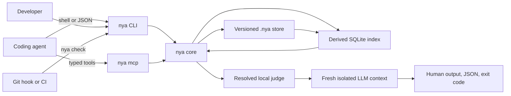

# Not You Again Architecture

## Status

The version 0.1 architecture is approved and the core runtime is implemented.
The source gates currently enforce 500 production lines and at least 95 percent
line coverage.

## Purpose

Not You Again is a repository-local scar runtime for coding agents.

It gives every agent working in a repository the same durable record of real
mistakes, their corrections, and their provenance. Before a task, the agent
recalls relevant scars. Before completion, a fresh isolated judge audits the
task diff against those scars.

## Public contract

The public model contains one concept:

> A scar is a durable lesson created from a real failure and correction.

The agent protocol contains three actions:

```text
A task is starting           -> nya recall
A real correction happened  -> nya remember
Work is about to finish      -> nya check
```

## System shape



The first release is one native Rust binary with one core and two transports.
The CLI serves humans, shell-capable agents, hooks, and CI. `nya mcp` serves
MCP-capable hosts over local stdio.

There is no daemon, hosted service, provider SDK, plugin runtime, or second data
path.

## Repository surface

Consumer repositories commit:

```text
.nya/
  .gitignore
  config.toml
  SKILL.md
  scars/
    NYA-01J2M6Y7R2W8Y0F7K5Q3C9A1B4.toml
```

Each scar is a readable TOML file. Git is the durable source of truth.

The derived database lives at:

```text
<git-dir>/nya/index-v1.sqlite3
```

It contains an FTS5 projection of searchable scar fields. Complete scars and
occurrences remain only in the versioned TOML files. Missing, corrupt, or
incompatible indexes rebuild automatically.

## Configuration boundary

The committed `.nya/config.toml` defines shared check policy. It never selects
a provider, model, credential, or executable.

Each developer selects a judge once with:

```bash
nya setup --judge codex
```

The resulting user configuration is stored in the operating system
configuration directory. A repository may optionally override that choice with
an ignored `.nya/config.local.toml`, created by:

```bash
nya setup --local --judge claude
```

Resolution is strict and deterministic. Repository-local configuration wins
over user configuration. Missing or invalid configuration fails closed. The
agent always runs `nya check` and never chooses a provider itself.

## Recall

Recall is deterministic and model-free.

Ranking uses:

1. Exact scope matches.
2. FTS5 relevance across task text, title, lesson, tags, and scope.
3. Independent occurrence count.
4. A modest latest-occurrence recency boost.

Every exact scope match is included.

## Remember

`nya remember` creates a scar or appends an occurrence to an explicitly selected
or exact normalized title match.

Every occurrence preserves reporter, corrector, recorder, represented actor,
source, commit, and time when available. The system never invents a reporter.

Fuzzy similarity never merges scars automatically.

## Check

`nya check` resolves tracked and untracked changes outside `.nya/`, retrieves
relevant scars, assembles a bounded diff, and invokes a fresh judge.

The judge may answer one question only:

> Does the completed task repeat any of these known repository scars?

Every finding requires a supplied scar ID, file, line, changed-code evidence,
and reason. Generic suggestions are invalid.

The normal green path uses one batch judge call. Proposed findings receive a
second focused confirmation call before they block.

Exit codes are:

| Code | Meaning |
| --- | --- |
| `0` | No supplied scar was repeated |
| `1` | At least one recurrence was confirmed |
| `2` | Repository, configuration, runner, timeout, or verdict failure |

## Judge execution

The judge is a resolved subprocess, not an in-process provider integration.
Built-in profiles cover Codex, Claude Code, and Hermes. A custom argv command
can implement the same protocol.

```text
stdin   one UTF-8 audit prompt
stdout  one verdict JSON object
stderr  optional diagnostics
exit 0  a parseable verdict was produced
exit !0 runner failure
```

`nya` owns retrieval, context assembly, prompt construction, schema validation,
focused confirmation, and final exit codes. The runner owns model access only.

The command runs in a new empty temporary directory and never resumes the
implementer's conversation. MCP calls use the same external judge and never ask
the connected host model to judge itself.

## Skill

`.nya/SKILL.md` teaches the three-action protocol. It contains no scars and no
product logic. `nya init` also installs an idempotent managed bridge into
existing root-level `AGENTS.md`, `CLAUDE.md`, and `GEMINI.md` files.

The skill is guidance rather than enforcement because agents can forget
instructions or lose them during context compaction. CLI, MCP, hooks, and CI
remain outside the model context.

## MCP

`nya mcp` exposes exactly:

```text
nya_remember
nya_recall
nya_check
```

Each tool takes an explicit repository root and calls the same domain operation
as its CLI counterpart. The server exposes no generic file, SQL, memory, prompt,
or model tools.

## Engineering constitution

```text
Production code: <= 500 LOC
Line coverage:  >= 95%
Test code:      unlimited
```

The line budget includes CLI, MCP, indexing, repository operations, judge
execution, and all maintained runtime behavior.

## Delivery status

### Implemented core

1. Durable scars, atomic writes, schema validation, and actor provenance.
2. SQLite FTS5 recall, automatic rebuild, scope ranking, and occurrence ranking.
3. Tracked and untracked diff assembly, scar selection, judge execution,
   verdict validation, and focused confirmation.
4. Layered project, user, and repository-local judge configuration.
5. Canonical skill, managed agent instructions, CLI, local stdio MCP, and
   end-to-end fixtures.

### Remaining distribution

1. Windows, macOS, and Linux binaries
2. Package-manager installation paths
3. Idempotent pre-push hook installation
4. Static host integration examples

## Deferred scope

Version 0.1 excludes hosted storage, a public scar corpus, remote MCP,
host-model judging, provider SDKs, embeddings, LLM deduplication, deterministic
per-scar checkers, review harvesting, organization-wide synchronization, a
plugin runtime, and a GUI.
