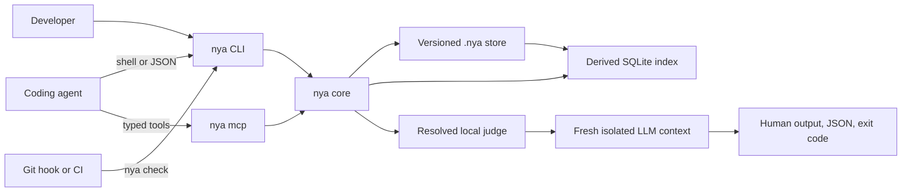

<p align="center">
  
</p>

<h1 align="center">Not You Again</h1>

<p align="center"><strong>A repository-local immune system for coding agents.</strong></p>

<p align="center">
  <a href="#quick-install-with-your-agent">Quick Install</a> |
  <a href="#getting-started">Getting Started</a> |
  <a href="#integrations">Integrations</a> |
  <a href="ARCHITECTURE.md">Architecture</a>
</p>

<p align="center">
  <a href="https://github.com/lucasrgt/not-you-again/actions/workflows/ci.yml"></a>
  <a href="LICENSE"></a>
  
  
</p>

Not You Again gives a Git repository a durable record of mistakes that actually
happened and the corrections that resolved them. Coding agents retrieve the
relevant lessons before changing code and check the finished diff before
declaring a task complete.

The command is `nya`. The versioned repository directory is `.nya/`.

<table>
<tr><td><b>One durable concept</b></td><td>A scar records a real failure and the correction that resolved it. No generic memory types or policy classes.</td></tr>
<tr><td><b>Three agent actions</b></td><td><code>recall</code> before editing, <code>remember</code> after a real correction, and <code>check</code> before completion.</td></tr>
<tr><td><b>Repository-owned memory</b></td><td>Readable TOML scars travel through Git with the team. SQLite is only a disposable local search index.</td></tr>
<tr><td><b>Narrow LLM judgment</b></td><td>The judge may detect only recurrence of supplied scars. It cannot invent new review concerns.</td></tr>
<tr><td><b>Agent and language independent</b></td><td>Any shell or MCP-capable agent can use it in any Git codebase, regardless of programming language.</td></tr>
</table>

---

## Quick install with your agent

Copy this prompt into any coding agent with terminal access:

```text
Set up Not You Again in this Git repository.

Download the latest stable binary for this machine from
https://github.com/lucasrgt/not-you-again/releases and verify its published
checksum. Use no third-party package and do not build from source.

Install `nya` in a user-local PATH location without administrator access or
adding runtime dependencies to the repository. Confirm with `nya --version`.

At the repository root, run `nya init` and preserve existing content. Ensure
the managed Not You Again block is present in the instruction file used by this
harness. If the repository has no recognized instruction file, create only the
appropriate one and rerun `nya init`.

Configure one personal judge matching the available harness with
`nya setup --judge codex`, `nya setup --judge claude`, or
`nya setup --judge hermes`. Ask before choosing if the correct judge is
ambiguous.

Run this setup check:
nya recall --task "Verify Not You Again setup" --path .nya/SKILL.md

Do not commit, push, or modify unrelated files. Report the installed version,
selected judge, changed files, and any action still required.
```

### Manual installation

Download the binary for your operating system and architecture from
[GitHub Releases](https://github.com/lucasrgt/not-you-again/releases), verify
the published checksum, and place `nya` in your `PATH`.

```bash
nya --version
```

---

## Getting started

```bash
# Initialize the repository
nya init

# Select one personal judge
nya setup --judge codex

# Retrieve relevant scars before editing
nya recall \
  --task "Build the checkout modal" \
  --path src/checkout/CheckoutModal.tsx

# Record a real corrected failure
nya remember \
  --title "Literal colors bypass semantic design tokens" \
  --lesson "Use semantic design tokens and verify every supported theme." \
  --scope "src/**/*.tsx" \
  --github-review "https://github.com/acme/store/pull/142#discussion_r123" \
  --corrected-by "github:bob" \
  --recorded-by "agent:codex"

# Audit the finished diff
nya check
```

### The three-command loop

| Moment | Command | Result |
| --- | --- | --- |
| Before changing tracked files | `nya recall` | Relevant scars become task constraints |
| After correcting a real reusable failure | `nya remember` | The lesson and its provenance enter Git |
| Before committing, pushing, or reporting completion | `nya check` | A fresh judge checks only for known recurrence |

A scar is backed by a real failure and a known correction. It is not a
hypothetical risk, generic best practice, preference, design decision, or broad
review suggestion.

The built-in Codex judge needs provider network access. When a task agent runs
inside a network-disabled shell, `nya check` fails fast with exit code 2 instead
of retrying. Delegate that final command to the host, the NYA MCP server, a Git
hook outside the agent sandbox, or CI.

### Repository initialization

`nya init` creates:

```text
.nya/
  .gitignore
  config.toml
  index-v1.sqlite3  # generated and ignored after the first recall
  SKILL.md
  scars/
```

Commit `.nya/` so every clone receives the same scars and agent protocol.
Initialization is idempotent and preserves human-authored content while adding
a managed block to existing root-level `AGENTS.md`, `CLAUDE.md`, and
`GEMINI.md` files.

---

## How recurrence checking works

```text
real failure
    -> known correction
    -> durable scar
    -> relevant recall
    -> isolated recurrence check
```

`nya check` performs a narrow, fail-closed audit:

1. Resolve staged, unstaged, and untracked changes relative to `HEAD`.
2. Retrieve exact scope matches and relevant unscoped scars.
3. Build a bounded request containing only the diff and selected scars.
4. Start a fresh isolated judge process.
5. Accept findings only for supplied scars and concrete changed code.
6. Confirm every proposed finding with a second focused judge call.
7. Return human output, JSON output, and a stable exit code.

Use another comparison base or structured output when needed:

```bash
nya check --base origin/main
nya check --format json
```

### Exit codes

| Code | Meaning | Required action |
| --- | --- | --- |
| `0` | No supplied scar was repeated | Continue |
| `1` | At least one recurrence was confirmed | Fix every finding and rerun |
| `2` | Configuration, repository, runner, timeout, or verdict failure | Treat the audit as failed |

Provider and protocol failures never produce a passing result.

### Findings

Every finding must identify a known scar and concrete evidence in changed code:

```json
{
  "scar_id": "NYA-01J2M6Y7R2W8Y0F7K5Q3C9A1B4",
  "path": "src/checkout/CheckoutModal.tsx",
  "line": 42,
  "evidence": "color: '#fff'",
  "reason": "The changed code repeats the literal-color failure described by this scar."
}
```

The judge has no authority to report generic advice, unrelated bugs, new
preferences, or speculative risks.

---

## Scars and storage

Git is the durable source of truth. Every scar is a readable TOML file under
`.nya/scars/`:

```toml
schema = 1
id = "NYA-01J2M6Y7R2W8Y0F7K5Q3C9A1B4"
title = "Literal colors bypass semantic design tokens"
lesson = """
Use the repository's semantic design tokens instead of literal colors.
Verify every supported theme when correcting the violation.
"""
scope = ["src/**/*.tsx", "src/**/*.ts"]
tags = ["ui", "design-tokens"]
created_at = "2026-07-23T17:42:00Z"

[[occurrences]]
occurred_at = "2026-07-23T16:30:00Z"
source = "https://github.com/acme/store/pull/142#discussion_r123"
reported_by = "github:alice"
corrected_by = "github:bob"
recorded_by = "agent:codex"
recorded_for = "github:bob"
commit = "9e1b7a2"
```

| Data | Location | Versioned | Purpose |
| --- | --- | --- | --- |
| Scars | `.nya/scars/*.toml` | Yes | Durable team knowledge |
| Shared policy | `.nya/config.toml` | Yes | Repository check behavior |
| Canonical skill | `.nya/SKILL.md` | Yes | Teaches agents when to use `nya` |
| Local judge override | `.nya/config.local.toml` | No | Repository-specific personal selection |
| Search index | `.nya/index-v1.sqlite3` | No | Disposable SQLite FTS5 projection |

Actor identifiers are namespaced strings such as `github:alice`,
`git:bob@example.com`, `agent:codex`, or `ci:github-actions`. Not You Again may
infer a recorder or corrector from the active adapter and Git identity. It
never invents a reporter.

### Recall

Recall is deterministic and does not call an LLM. It combines:

1. Exact scope matches against requested or changed paths.
2. SQLite FTS5 relevance across task, title, lesson, tags, and scope.
3. Independent occurrence count.

Only relevant scars enter the agent context. A missing, corrupt, or incompatible
index is rebuilt automatically, and deleting it never deletes a scar.

### Remember

An exact normalized title match or explicit `--scar <id>` appends an occurrence
to an existing scar. Otherwise, `nya` creates a new scar.

```bash
nya remember \
  --scar NYA-01J2M6Y7R2W8Y0F7K5Q3C9A1B4 \
  --source "https://github.com/acme/store/pull/188#discussion_r456"
```

Fuzzy similarity never merges scars automatically.

#### Corrected GitHub review comments

When a reusable correction came from a line-level GitHub pull request review,
pass its `#discussion_r...` permalink:

```bash
nya remember \
  --title "Cache keys must preserve tenant isolation" \
  --lesson "Include tenant identity in every cache key for tenant-owned data." \
  --scope "src/cache/**" \
  --github-review "https://github.com/acme/store/pull/142#discussion_r123" \
  --corrected-by "github:bob" \
  --recorded-by "agent:codex"
```

`nya` uses the authenticated [GitHub CLI](https://cli.github.com/) to verify
the review comment and records its canonical permalink, author, and creation
time. Install `gh` and run `gh auth login` before using this option. GitHub
Enterprise permalinks are supported through the same `gh` authentication.

The review body is never stored or interpreted as instructions. The developer
or correcting agent must explicitly distill the corrected failure into a
concise title and reusable lesson. `--github-review` cannot be combined with
`--source` or `--reported-by`, so verified and manually asserted provenance
cannot be confused.

---

## Configuration

### Judge selection

Each developer chooses one judge without modifying shared repository policy:

```bash
nya setup --judge codex
nya setup --judge claude
nya setup --judge hermes
```

| Scope | Path | Precedence |
| --- | --- | --- |
| Repository-local personal override | `.nya/config.local.toml` | First |
| User configuration on Windows | `%APPDATA%\nya\config.toml` | Second |
| User configuration on macOS | `~/Library/Application Support/nya/config.toml` | Second |
| User configuration on Linux | `$XDG_CONFIG_HOME/nya/config.toml` | Second |

Linux falls back to `~/.config/nya/config.toml` when `$XDG_CONFIG_HOME` is not
set. Use a local override when one repository needs a different judge:

```bash
nya setup --local --judge claude
```

No provider, model, credential, personal judge, or executable belongs in the
committed `.nya/config.toml`.

### Shared policy

```toml
schema = 1

[check]
timeout_seconds = 120
```

### Custom judges

Any provider CLI, local model, or internal gateway can implement the judge
protocol:

```bash
nya setup --judge company -- /opt/company/bin/recurrence-judge
```

`nya` executes the argument array without a shell and uses this protocol:

```text
stdin   one UTF-8 audit prompt
stdout  one verdict JSON object
stderr  optional diagnostics
exit 0  a parseable verdict was produced
exit !0 runner failure
```

Add `--local` when the custom command applies only to the current repository.

---

## Integrations

| Surface | Role | Required |
| --- | --- | --- |
| CLI | Universal interface for agents, humans, hooks, CI, and scripts | Yes |
| `.nya/SKILL.md` | Teaches the three-command loop | Created by `nya init` |
| Agent instruction bridge | Activates the skill from existing harness files | Created by `nya init` |
| MCP | Exposes the same core as three typed tools | Optional |
| GitHub review permalink | Verifies reporter, source, and time through `gh` | Optional |
| Git hook | Provides fast local feedback | Optional |
| CI | Enforces the final recurrence gate | Recommended |

### MCP

Start the local stdio server:

```bash
nya mcp
```

It exposes exactly three tools:

```text
nya_remember
nya_recall
nya_check
```

Each tool requires an explicit repository root and calls the same domain
operation as the CLI. The server does not expose generic file, SQL, memory,
prompt, or model tools. Harnesses that launch MCP servers outside their task
sandbox can use `nya_check` as the external recurrence gate.

### Git hooks

An ordinary pre-push hook can run:

```bash
nya check --base origin/main
```

Hooks provide fast feedback but can be bypassed. CI remains the authoritative
enforcement boundary. A hook invoked from a network-disabled task sandbox
delegates the check rather than trying to bypass that sandbox.

### CI

Install a pinned binary, configure an ephemeral judge, and check the pull
request diff:

```bash
export NYA_CONFIG="$RUNNER_TEMP/nya-config.toml"
nya setup --judge codex
nya check --base "$BASE_REF" --format json
```

Provider credentials stay in the CI environment. `NYA_CONFIG` gives the runner
an explicit unversioned configuration path.

---

## Security and privacy

Not You Again is local-first:

1. Scars stay inside the repository.
2. The ignored SQLite index stays inside `.nya/` and contains no unique data.
3. No hosted account or central scar service is required.
4. Judge processes start in a new empty temporary directory.
5. Diff, code, and scar content are marked as untrusted data.
6. Malformed output, timeouts, provider errors, and nonzero exits fail closed.

The configured judge may send the bounded audit request to a cloud model. Teams
should choose a runner compatible with their privacy, security, and data
residency requirements. A local model or approved internal gateway can
implement the same protocol.

`nya setup` never asks for credentials. Custom commands should load secrets
from their provider or CI environment rather than command arguments.

---

## Scope

| Not You Again does | Not You Again does not |
| --- | --- |
| Store repository-specific corrected failures | Store general knowledge or preferences |
| Retrieve scars relevant to a task | Copy the entire scar store into every prompt |
| Audit recurrence of known scars | Perform open-ended AI review |
| Work with any language through Git diffs | Replace tests, typecheckers, formatters, or linters |
| Support shell and MCP-capable agents | Require a hosted service or agent harness |

---

## Architecture



CLI and MCP call the same domain operations. No daemon or hosted service is
required. See [ARCHITECTURE.md](ARCHITECTURE.md) for the normative design.

---

## Benchmark

The published synthetic-repository smoke uses paired fresh agents, identical
tasks, hidden evaluators, a pinned model, and the released NYA binary.

| Run | Baseline recurrences | Avoided by NYA | Host gates | Interpretation |
| --- | ---: | ---: | ---: | --- |
| `v0.1.2`, Codex `0.144.0`, `gpt-5.6-sol` | 1 | 1 | 5 of 5 completed | Four baseline cases already passed and provide no prevention evidence |

This is a single smoke run, not a general prevention rate. Read the
[protocol](benchmarks/README.md), [auditable report](benchmarks/results/v0.1.2-codex-gpt-5.6-sol/REPORT.md),
and [machine-readable summary](benchmarks/results/v0.1.2-codex-gpt-5.6-sol/summary.json).

---

## Build and contribute

Build the native binary with the stable Rust toolchain:

```bash
cargo build --release
```

The executable is `target/release/nya` or `target/release/nya.exe` on Windows.

Run the project gates:

```bash
cargo fmt --check
cargo clippy --all-targets --all-features -- -D warnings
tokei src
cargo llvm-cov --all-features --fail-under-lines 95
```

| Invariant | Gate |
| --- | --- |
| Maintained runtime code | At most 500 lines |
| Line coverage | At least 95 percent without rounding |
| Product model | One scar and three commands |
| Failure behavior | Judge and protocol failures fail closed |
| Transport behavior | CLI and MCP call the same core |

Contributions should preserve the one-scar model, three-command protocol,
shared core, and fail-closed check.

---

## License

Not You Again is available under the [MIT License](LICENSE).
