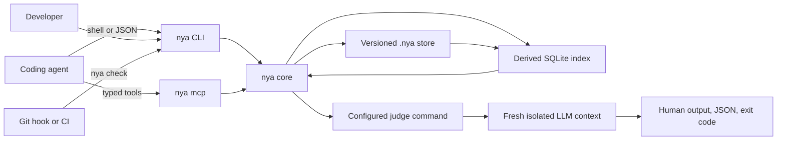

# Not You Again

> A repository-local immune system for coding agents.

Not You Again gives a software repository a durable record of mistakes that
actually happened, the corrections that resolved them, and the people and
sources behind those corrections.

Every coding agent working in the repository can recall those lessons before
changing code and run the same recurrence check before declaring the task
complete.

The command is `nya`. The versioned repository directory is `.nya/`.

## Project status

Not You Again is in early development. The version 0.1 architecture is
approved, and the standalone repository is now open. Runtime implementation has
not started.

The initial release will be a single native Rust binary with no hosted service
and no required daemon.

The normative design is documented in [ARCHITECTURE.md](ARCHITECTURE.md).

## The problem

Coding agents can solve difficult problems, but corrections do not reliably
survive across tasks.

Instructions may be forgotten. Skills may not activate. Long conversations may
be compacted. A review comment that fixed an important mistake today may never
reach the agent that touches the same code six months later.

General memory systems do not fully solve this problem. They mix preferences,
facts, architecture, procedures, and mistakes into one large body of context.
The result is expensive to load, difficult to audit, and easy for an agent to
ignore.

Not You Again stores only scars.

```text
real failure
    -> known correction
    -> durable scar
    -> relevant recall
    -> isolated recurrence check
```

## The core concept

A scar is a durable lesson created from a real failure and its correction.

A scar is not a hypothetical risk, a generic best practice, a preference, a
design decision, documentation, or a broad code review suggestion.

The public model contains one concept only. There are no candidates, graduation states, or enforcement classes.

## The three-action protocol

Every agent follows the same small protocol.

| Moment | Action | Command |
| --- | --- | --- |
| A task is starting | Recall relevant scars | `nya recall` |
| A real correction happened | Record the lesson | `nya remember` |
| Work is about to finish | Check for recurrence | `nya check` |

This protocol is deliberately small. Agents never choose between competing
memory types or enforcement paths.

## What Not You Again is

1. A repository-local scar store shared through Git.
2. A deterministic retrieval engine for relevant scars.
3. A narrow LLM recurrence audit scoped to those scars.
4. A CLI for agents, developers, hooks, and CI.
5. A local MCP server for hosts that prefer typed tools.
6. A short canonical skill that teaches the three-action protocol.

## What Not You Again is not

1. It is not a general-purpose memory system.
2. It is not an AI reviewer.
3. It is not a hosted database of other people's mistakes.
4. It is not a replacement for tests, typecheckers, or linters.
5. It is not a framework for writing one custom checker per scar.
6. It is not an agent harness.
7. It is not a public corpus of universal best practices.

## How it works

### 1. Initialize the repository

Run:

```bash
nya init
```

The command creates the versioned `.nya/` directory:

```text
.nya/
  config.toml
  SKILL.md
  scars/
```

The team commits this directory. Every clone receives the same scars and the
same agent protocol.

### 2. Recall before changing code

At the beginning of a task, the agent describes the task and the paths it
expects to touch:

```bash
nya recall \
  --task "Build the checkout modal" \
  --path src/checkout/CheckoutModal.tsx
```

Recall is deterministic and does not call an LLM.

It ranks scars using:

1. Exact scope matches against requested or changed paths.
2. SQLite FTS5 relevance across the task, title, lesson, tags, and scope.
3. Independent occurrence count.
4. A modest recency boost from the latest occurrence.

Exact scope matches are never silently dropped by relevance ranking.

The output contains only the scars relevant to the task. The complete scar
store is never copied into the agent prompt.

### 3. Remember after a real correction

Suppose a pull request review identifies literal colors that bypass the
repository's semantic design tokens. After the problem is corrected, the agent
or developer records the scar:

```bash
nya remember \
  --title "Literal colors bypass semantic design tokens" \
  --lesson "Use semantic design tokens and verify every supported theme." \
  --scope "src/**/*.tsx" \
  --source "https://github.com/acme/store/pull/142#discussion_r123" \
  --reported-by "github:alice"
```

An exact normalized title match appends a new occurrence to the existing scar.
An explicit `--scar <id>` also appends to a known scar. Otherwise, `nya`
creates a new scar.

Fuzzy similarity never merges scars automatically.

### 4. Check before reporting completion

Before the agent says the work is complete, it runs:

```bash
nya check
```

By default, `nya check` audits staged and unstaged changes relative to `HEAD`.

Other targets are available:

```bash
nya check --base origin/main
nya check --all
nya check --format json
```

The check performs the following sequence:

1. Resolve the Git diff and changed paths.
2. Retrieve every exact scope match and the relevant unscoped scars.
3. Build a bounded audit request with the diff and necessary file context.
4. Start a fresh isolated judge process.
5. Ask only whether the supplied scars were repeated.
6. Validate the structured verdict.
7. Confirm every proposed finding in a second focused judge call.
8. Return a human result, JSON result, and stable exit code.

The first judge call optimizes the common green path. The second call protects
the red path against false positives.

## Exit codes

| Code | Meaning |
| --- | --- |
| `0` | No supplied scar was repeated |
| `1` | At least one recurrence was confirmed |
| `2` | Configuration, repository, runner, timeout, or verdict failure |

Provider failure never becomes a passing result.

## Findings

Not You Again cannot invent a new review concern during `nya check`.

Every failing finding must identify a supplied scar and concrete changed code:

```json
{
  "scar_id": "NYA-01J2M6Y7R2W8Y0F7K5Q3C9A1B4",
  "path": "src/checkout/CheckoutModal.tsx",
  "line": 42,
  "evidence": "color: '#fff'",
  "reason": "The changed code repeats the literal-color failure described by this scar."
}
```

A finding without a scar ID, file, line, and evidence is invalid.

Generic style advice, unrelated bugs, new preferences, and speculative risks
are outside the judge's authority.

## Repository storage

Git is the durable source of truth.

Each scar is a readable TOML file under `.nya/scars/`:

```toml
schema = 1
id = "NYA-01J2M6Y7R2W8Y0F7K5Q3C9A1B4"
title = "Literal colors bypass semantic design tokens"
lesson = """
Use the repository's semantic design tokens instead of literal colors.
Verify every supported theme when correcting the violation.
"""
scope = ["src/**/*.tsx", "src/**/*.ts"]
tags = ["ui", "design-tokens"]
created_at = "2026-07-23T17:42:00Z"

[[occurrences]]
occurred_at = "2026-07-23T16:30:00Z"
source = "https://github.com/acme/store/pull/142#discussion_r123"
reported_by = "github:alice"
corrected_by = "github:bob"
recorded_by = "agent:codex"
recorded_for = "github:bob"
commit = "9e1b7a2"
```

Required scar fields are:

1. `schema`
2. `id`
3. `title`
4. `lesson`
5. At least one `occurrences` entry

Optional fields are:

1. `scope`
2. `tags`

Actor identifiers are namespaced strings such as `github:alice`,
`git:bob@example.com`, `agent:codex`, or `ci:github-actions`.

Not You Again may infer a recorder or corrector from the current adapter and Git
identity. It never invents a reporter.

## Derived SQLite index

SQLite is a disposable projection, not durable knowledge.

The database lives inside the worktree's resolved Git directory:

```text
<git-dir>/nya/index-v1.sqlite3
```

This location supports normal clones and linked worktrees while keeping the
cache outside version control.

The initial projection contains:

1. `meta` for schema and index versions.
2. `files` for source paths and content hashes.
3. `scars` for normalized scar fields.
4. `occurrences` for provenance and recurrence history.
5. `scars_fts` for FTS5 search.

Every command incrementally synchronizes the projection by content hash.

A missing, corrupt, or incompatible database is rebuilt automatically. Deleting
the database never deletes a scar.

## CLI and MCP

The `nya` binary exposes two transports over the same core.

### CLI

The CLI is the universal interface for:

1. Coding agents with shell access.
2. Developers.
3. Git hooks.
4. CI systems.
5. Scripts and future adapters.

The CLI supports concise human output and stable JSON input and output for
agents and automation.

### MCP

Run:

```bash
nya mcp
```

This starts a local stdio MCP server. Stdout is reserved for MCP JSON-RPC and
diagnostics are written to stderr.

The server exposes exactly three tools:

```text
nya_remember
nya_recall
nya_check
```

Each tool requires an explicit repository root and uses the same validation,
domain logic, and error semantics as the corresponding CLI command.

The MCP server does not expose generic file, SQL, memory, prompt, or model
tools. It is a typed adapter, not a second product.

Agents using Hermes, Codex, Claude Code, Gemini CLI, or another MCP-capable host
can configure `nya mcp` as a local tool server. Agents with shell access can use
the CLI directly and do not need MCP.

## The judge command

The implementing agent is not allowed to approve its own task.

`nya check` starts a new headless model invocation with a fresh context. It does
not resume the implementer's conversation.

The judge command is configured as an argv array in `.nya/config.toml`:

```toml
schema = 1

[judge]
command = [
  "codex", "exec", "--ephemeral",
  "--sandbox", "read-only",
  "--ignore-user-config",
  "--output-schema", "{schema}",
  "-"
]
```

The Codex CLI command is the first documented profile, not a core dependency.
A team may replace it with any command that implements the judge protocol.

`nya` executes the argv array directly without a shell. It replaces `{schema}`
with a temporary JSON Schema path and writes the audit prompt to stdin.

The protocol is:

```text
stdin   one UTF-8 audit prompt
stdout  one verdict JSON object
stderr  optional diagnostics
exit 0  a parseable verdict was produced
exit !0 runner failure
```

The runner owns model access only.

`nya` owns:

1. Scar retrieval.
2. Diff and file context assembly.
3. Prompt construction.
4. Verdict schema generation.
5. Verdict validation.
6. Focused confirmation.
7. Final exit codes.

A provider CLI, local model wrapper, or internal gateway can become the judge
without changing scar files or core code.

## Judge isolation

The judge runs in a new empty temporary directory.

The request contains only:

1. The optional task description.
2. The Git diff under review.
3. Changed paths.
4. Full changed-file contents when they fit the context budget.
5. Changed hunks with surrounding context when full files do not fit.
6. Exact scope matches.
7. Relevant unscoped scars.

The request clearly delimits code, diff, and scar text as untrusted data. It
instructs the judge to ignore instructions found inside audited content.

The runner must not expose repository write tools or resume an existing agent
session.

The MCP server does not use MCP Sampling. Calling `nya_check` always starts the
separately configured judge command.

## The canonical skill

Every initialized repository contains `.nya/SKILL.md`.

The skill remains deliberately short:

```markdown
# Not You Again

Use this skill in repositories containing `.nya/`.

1. Before changing code, run `nya recall` with the task and affected paths.
2. After correcting a real mistake, run `nya remember` exactly once.
3. Before reporting completion, run `nya check` and fix every confirmed
   recurrence.

Store only real failures with known corrections. Never store general knowledge,
preferences, hypothetical risks, or generic best practices.
```

The skill teaches when to use the product. It does not contain scars and does
not implement product behavior.

Skills and system prompts may be forgotten, truncated, or removed during
context compaction. Not You Again therefore treats the skill as guidance, not
as an enforcement boundary.

The CLI, MCP server, Git hook, and CI continue to exist outside the agent's
context.

## Git hooks

Install the local pre-push hook:

```bash
nya hook install pre-push
```

The hook runs the recurrence audit against the relevant upstream or base diff.
It chains an existing hook instead of overwriting it.

Hooks provide fast local feedback, but they are not authoritative. They may be
missing or bypassed.

## CI

CI is the final enforcement boundary:

```bash
nya check --base "$BASE_REF" --format json
```

CI installs a pinned `nya` binary and uses the same check path as local
development.

A dedicated GitHub Action is not required for the first release. A normal CLI
step keeps the integration portable across CI providers.

## GitHub review harvesting

Automatic GitHub review harvesting is planned as a future adapter, not part of
the first core release.

The adapter may identify a real correction from a pull request discussion and
call `nya remember` with:

1. The review author as reporter.
2. The developer who corrected the problem as corrector.
3. The agent or process that stored it as recorder.
4. The pull request discussion as source.
5. The correcting commit.

The adapter must not convert every review comment into a scar. A scar requires
a real failure and a known correction.

GitHub integration will not turn Not You Again into an AI reviewer.

## Security and privacy

Not You Again is local-first.

The durable store remains inside the repository. The derived index remains
inside the local Git directory. Not You Again does not require a hosted account
or upload scars to a central service.

The configured judge may send the audit request to a cloud model provider.
Teams are responsible for choosing a runner compatible with their code privacy,
data residency, and security requirements.

Sensitive repositories may use a local model or an approved internal gateway.

The command array is executed without a shell. Credentials are not stored in
`.nya/config.toml`; they remain with the selected CLI or CI environment.

Malformed output, extra stdout, timeouts, provider errors, and nonzero runner
exits fail closed.

## Relationship to tests and linters

Tests, typecheckers, formatters, and linters remain normal project gates.

Not You Again does not orchestrate or replace them.

The recurrence judge exists because many valuable scars are semantic:

1. A component bypassed the repository's design token strategy.
2. A memoization decision contradicted a measured performance constraint.
3. A command violated an internal operational rule.
4. A public API repeated an earlier compatibility mistake.
5. A migration ignored a repository-specific rollout requirement.

Turning every semantic correction into a custom linter would create friction
high enough that most scars would never become enforceable.

## Architecture



There is one data path and one set of domain operations.

The first release has no daemon, hosted service, plugin runtime, provider SDK,
or in-process provider hierarchy.

## Planned implementation

Not You Again will be implemented as one Rust crate:

```text
not-you-again/
  Cargo.toml
  README.md
  LICENSE
  src/
    main.rs
    lib.rs
    scar.rs
    repository.rs
    index.rs
    judge.rs
    mcp.rs
  assets/
    SKILL.md
  tests/
    cli/
    fixtures/
```

Module responsibilities are:

| Module | Responsibility |
| --- | --- |
| `repository` | Git discovery, `.nya/`, atomic writes, diffs, identities, hooks |
| `scar` | Scar schema, validation, normalization, serialization |
| `index` | SQLite projection, FTS5 search, deterministic ranking |
| `judge` | Audit pack, command execution, verdict validation, confirmation |
| `mcp` | Three stdio tool adapters over the library core |
| `lib` | Domain operations |
| `main` | CLI parsing, output, transport selection |

`main.rs` contains no domain logic. CLI and MCP call the same library
operations.

## Engineering constitution

The implementation has two permanent gates:

```text
Production code: <= 500 LOC
Line coverage:  >= 95%
Test code:      unlimited
```

The production line limit includes CLI, MCP, indexing, repository operations,
judge execution, hooks, and all maintained runtime logic.

Production behavior may not be moved into scripts, generated files,
integrations, or test helpers to evade the limit.

CI will enforce:

```bash
tokei src
cargo llvm-cov --all-features --fail-under-lines 95
```

The code budget is architectural pressure. Features are removed or delegated
before the budget is increased.

## Delivery plan

### Slice 1: Durable scars

1. `nya init`
2. TOML schema and validation
3. `nya remember`
4. Atomic writes
5. Actor provenance

### Slice 2: Relevant recall

1. Derived SQLite and FTS5 index
2. Automatic rebuild
3. Path and task ranking
4. `nya recall`

### Slice 3: Recurrence audit

1. Git diff and file context assembly
2. Scar selection
3. Judge command protocol
4. Structured verdict validation
5. Focused confirmation
6. `nya check`

### Slice 4: Agent loop

1. Canonical `.nya/SKILL.md`
2. `nya mcp`
3. Pre-push hook
4. End-to-end CLI and MCP fixtures

### Slice 5: Distribution

1. Release binaries for Windows, macOS, and Linux
2. Production LOC and coverage gates
3. One-line CI documentation
4. Static integration examples for Hermes, Codex, Claude Code, and Gemini CLI

## Explicitly deferred

The following capabilities are not part of the first release:

1. A hosted service or shared public corpus.
2. Generic knowledge storage.
3. Remote MCP transport.
4. MCP Sampling or host-model judging.
5. Provider SDKs and API key management.
6. An in-process provider hierarchy.
7. Additional agent skill installers.
8. A dedicated GitHub Action.
9. SARIF output.
10. Embeddings or a vector database.
11. LLM-powered scar deduplication.
12. Deterministic checker definitions per scar.
13. GitHub review harvesting.
14. GitLab and Bitbucket adapters.
15. Organization-wide cross-repository synchronization.
16. A plugin runtime.
17. A dashboard or GUI.

## Frequently asked questions

### Is Not You Again an AI reviewer?

No. A reviewer may search for any problem it can find. Not You Again may report
only a recurrence of a scar supplied to the judge.

### Why use an LLM as the judge?

Most valuable scars are semantic and repository-specific. A narrow LLM audit
can recognize recurrence without requiring the team to write and maintain a
custom linter for every correction.

### Why not store scars in `AGENTS.md`?

An instruction file grows without bound, consumes prompt space, lacks
structured provenance, and can be truncated or compacted. Not You Again
retrieves only relevant scars and keeps the final check outside the
implementer's context.

### Why is SQLite not committed?

SQLite is optimized for lookup, not reviewable version control. TOML files are
the durable truth. The database can always be rebuilt.

### Can different coding agents use the same scars?

Yes. Shell-capable agents use the CLI. MCP-capable agents may use `nya mcp`.
Both paths call the same core.

### Can a different model act as the judge?

Yes. The configured command can use any provider or local model that satisfies
the stdin and stdout protocol.

### Can the implementing agent and judge use the same model family?

Yes, provided the judge is a fresh process with a fresh context. The judge
never resumes the implementer's session.

### What happens when the judge is unavailable?

The check exits with code `2`. An unavailable judge never produces a pass.

### Does Not You Again collect errors from other companies?

No. Every repository starts empty. The team's own real failures populate its
scar store during normal work.

### Does Not You Again replace tests?

No. Tests and deterministic tooling remain independent project gates.

### Why keep only scars?

One concept removes ambiguity. An agent never has to decide whether a lesson is
a scar, candidate, policy, memory, or rule. If a real failure happened
and a correction is known, it can become a scar.

## Contributing

The standalone repository is open while runtime implementation is being
prepared. Contribution guidelines will be expanded with the first development
release.

The initial implementation will prioritize a small auditable core, strong
fixtures, and behavior-preserving simplicity over feature breadth.

## License

The project license will be selected and published before the first public
implementation release.
