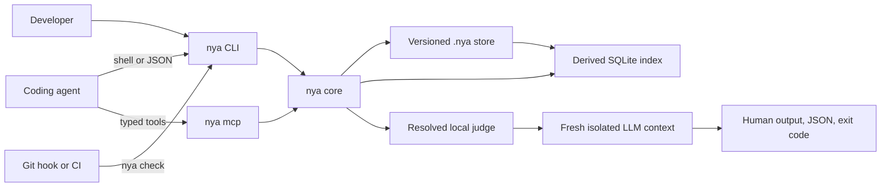

<p align="center">
  
</p>

<h1 align="center">Not You Again</h1>

<p align="center"><strong>A repository-local immune system for coding agents.</strong></p>

Not You Again gives a Git repository a durable record of mistakes that actually
happened and the corrections that resolved them. Coding agents retrieve the
relevant lessons before changing code and check the finished diff before
declaring a task complete.

The command is `nya`. The versioned repository directory is `.nya/`.

## Why

Review comments and corrections do not reliably survive across tasks. Agent
instructions may be forgotten, skills may not activate, and long conversations
may be compacted. A mistake corrected today can quietly return months later.

General memory systems mix preferences, facts, architecture, procedures, and
mistakes into one growing context. Not You Again stores only scars:

```text
real failure
    -> known correction
    -> durable scar
    -> relevant recall
    -> isolated recurrence check
```

A scar is a reusable lesson backed by a real failure and its correction. It is
not a hypothetical risk, generic best practice, preference, design decision,
or broad review suggestion.

## Three commands

| Moment | Action | Command |
| --- | --- | --- |
| A task is starting | Retrieve relevant scars | `nya recall` |
| A real correction happened | Record the lesson | `nya remember` |
| Work is about to finish | Check for recurrence | `nya check` |

There is one public concept and one workflow. Agents never choose between
memory types, enforcement classes, or competing review modes.

## Installation

### Agent bootstrap

> Copy this prompt into any coding agent with terminal access.

```text
Set up Not You Again in this Git repository.

Download the latest stable binary for this machine from
https://github.com/lucasrgt/not-you-again/releases and verify its published
checksum. Use no third-party package and do not build from source.

Install `nya` in a user-local PATH location without administrator access or
adding runtime dependencies to the repository. Confirm with `nya --version`.

At the repository root, run `nya init` and preserve existing content. Ensure
the managed Not You Again block is present in the instruction file used by this
harness. If the repository has no recognized instruction file, create only the
appropriate one and rerun `nya init`.

Configure one personal judge matching the available harness with
`nya setup --judge codex`, `nya setup --judge claude`, or
`nya setup --judge hermes`. Ask before choosing if the correct judge is
ambiguous.

Run this setup check:
nya recall --task "Verify Not You Again setup" --path .nya/SKILL.md

Do not commit, push, or modify unrelated files. Report the installed version,
selected judge, changed files, and any action still required.
```

### Manual installation

Download the latest binary for your operating system and architecture from
[GitHub Releases](https://github.com/lucasrgt/not-you-again/releases), verify
the published checksum, and place `nya` in your `PATH`.

Confirm the installation:

```bash
nya --version
```

## Quick start

### Initialize the repository

```bash
nya init
```

This creates:

```text
.nya/
  .gitignore
  config.toml
  SKILL.md
  scars/
```

Commit `.nya/` so every clone receives the same scars and agent protocol.

Initialization also adds an idempotent managed block to existing root-level
`AGENTS.md`, `CLAUDE.md`, and `GEMINI.md` files without replacing their
human-authored content.

### Configure a judge

Judge selection belongs to each developer, not to the repository:

```bash
nya setup --judge codex
nya setup --judge claude
nya setup --judge hermes
```

Use an ignored repository-local override when necessary:

```bash
nya setup --local --judge claude
```

### Recall before editing

Describe the task and expected paths:

```bash
nya recall \
  --task "Build the checkout modal" \
  --path src/checkout/CheckoutModal.tsx
```

Recall is deterministic and does not call an LLM. It combines exact scope
matches with SQLite FTS5 ranking across the task, title, lesson, tags, and
scope. Only relevant scars enter the agent context.

### Remember a correction

After correcting a real reusable failure:

```bash
nya remember \
  --title "Literal colors bypass semantic design tokens" \
  --lesson "Use semantic design tokens and verify every supported theme." \
  --scope "src/**/*.tsx" \
  --source "https://github.com/acme/store/pull/142#discussion_r123" \
  --reported-by "github:alice"
```

An exact normalized title match or explicit `--scar <id>` appends an occurrence
to an existing scar. Otherwise, `nya` creates a new scar. Fuzzy similarity
never merges scars automatically.

### Check before completion

```bash
nya check
```

The default check covers staged changes, unstaged changes, and untracked files
relative to `HEAD`. `.nya/` is excluded from the audited diff.

To compare against another base or receive structured output:

```bash
nya check --base origin/main
nya check --format json
```

## Recurrence checking

`nya check`:

1. Resolves the Git diff and changed paths.
2. Retrieves exact scope matches and relevant unscoped scars.
3. Builds a bounded audit request from the diff and scars.
4. Starts a fresh isolated judge process.
5. Accepts findings only for supplied scars and concrete changed code.
6. Confirms each proposed finding with a second focused judge call.
7. Returns human output, JSON output, and a stable exit code.

The judge cannot introduce a new review concern. Every finding must identify a
known scar, file, line, and concrete evidence:

```json
{
  "scar_id": "NYA-01J2M6Y7R2W8Y0F7K5Q3C9A1B4",
  "path": "src/checkout/CheckoutModal.tsx",
  "line": 42,
  "evidence": "color: '#fff'",
  "reason": "The changed code repeats the literal-color failure described by this scar."
}
```

Generic advice, unrelated bugs, new preferences, and speculative risks are
outside the judge's authority.

### Exit codes

| Code | Meaning |
| --- | --- |
| `0` | No supplied scar was repeated |
| `1` | At least one recurrence was confirmed |
| `2` | Configuration, repository, runner, timeout, or verdict failure |

Provider and protocol failures never produce a passing result.

## Storage

Git is the durable source of truth. Each scar is a readable TOML file under
`.nya/scars/`:

```toml
schema = 1
id = "NYA-01J2M6Y7R2W8Y0F7K5Q3C9A1B4"
title = "Literal colors bypass semantic design tokens"
lesson = """
Use the repository's semantic design tokens instead of literal colors.
Verify every supported theme when correcting the violation.
"""
scope = ["src/**/*.tsx", "src/**/*.ts"]
tags = ["ui", "design-tokens"]
created_at = "2026-07-23T17:42:00Z"

[[occurrences]]
occurred_at = "2026-07-23T16:30:00Z"
source = "https://github.com/acme/store/pull/142#discussion_r123"
reported_by = "github:alice"
corrected_by = "github:bob"
recorded_by = "agent:codex"
recorded_for = "github:bob"
commit = "9e1b7a2"
```

Actor identifiers are namespaced strings such as `github:alice`,
`git:bob@example.com`, `agent:codex`, or `ci:github-actions`. Not You Again may
infer a recorder or corrector from the active adapter and Git identity. It
never invents a reporter.

### SQLite index

SQLite is a disposable search projection stored outside version control:

```text
<git-dir>/nya/index-v1.sqlite3
```

The readable TOML files remain the complete representation of every scar.
Recall refreshes the index transactionally. A missing, corrupt, or incompatible
database is rebuilt automatically, and deleting it never deletes a scar.

## Configuration

The committed `.nya/config.toml` contains shared check policy:

```toml
schema = 1

[check]
timeout_seconds = 120
```

Personal judge configuration is stored at:

```text
Windows  %APPDATA%\nya\config.toml
macOS    ~/Library/Application Support/nya/config.toml
Linux    $XDG_CONFIG_HOME/nya/config.toml
```

Linux falls back to `~/.config/nya/config.toml` when `$XDG_CONFIG_HOME` is not
set. Repository-local selection uses the ignored `.nya/config.local.toml`.

Configuration resolves in this order:

1. `.nya/config.local.toml`
2. User configuration
3. Exit code `2` with a setup instruction

No provider, model, credential, personal judge, or executable belongs in
committed project configuration.

### Custom judges

Configure an explicit command after `--`:

```bash
nya setup --judge company -- /opt/company/bin/recurrence-judge
```

Add `--local` when the command applies only to the current repository.

`nya` executes the argument array without a shell. It writes the audit request
to stdin and expects one verdict JSON object on stdout:

```text
stdin   one UTF-8 audit prompt
stdout  one verdict JSON object
stderr  optional diagnostics
exit 0  a parseable verdict was produced
exit !0 runner failure
```

## Agent integration

Every initialized repository contains `.nya/SKILL.md`. The skill teaches agents
when to call `recall`, `remember`, and `check`; it does not contain scars or
implement product behavior.

`nya init` copies a managed instruction block from
[`assets/AGENT_INSTRUCTIONS.md`](assets/AGENT_INSTRUCTIONS.md) into recognized
agent instruction files. Skills and prompts remain guidance. The CLI, MCP
server, hooks, and CI provide execution boundaries outside agent context.

### MCP

Start the local stdio server:

```bash
nya mcp
```

It exposes three typed tools:

```text
nya_remember
nya_recall
nya_check
```

Each tool requires an explicit repository root and calls the same core operation
as the CLI. The server does not expose generic file, SQL, memory, prompt, or
model tools.

Shell-capable agents can use the CLI directly. MCP is an optional transport for
hosts that prefer typed tools.

### Git hooks

An ordinary pre-push hook can run:

```bash
nya check --base origin/main
```

Local hooks provide fast feedback. CI remains the authoritative enforcement
boundary because hooks can be missing or bypassed.

### CI

Install a pinned `nya` binary, configure an ephemeral judge, and check the pull
request diff:

```bash
export NYA_CONFIG="$RUNNER_TEMP/nya-config.toml"
nya setup --judge codex
nya check --base "$BASE_REF" --format json
```

Provider credentials stay in the CI environment. `NYA_CONFIG` gives the runner
an explicit unversioned configuration path.

## Security and privacy

Not You Again is local-first. Scars stay in the repository and the derived
index stays in the local Git directory. No hosted account or central scar
service is required.

The configured judge may send the bounded audit request to a cloud model.
Teams should select a runner compatible with their privacy, security, and data
residency requirements. A local model or approved internal gateway can
implement the same judge protocol.

The judge runs in a new empty temporary directory with no repository write
tools. The request marks diff, code, and scar content as untrusted data and
instructs the judge to ignore embedded instructions.

`nya setup` never asks for credentials. Custom commands should load secrets
from their provider or CI environment rather than command arguments. Malformed
output, timeouts, provider errors, and nonzero runner exits fail closed.

## Scope

Not You Again:

1. Stores repository-specific failures shared through Git.
2. Retrieves only scars relevant to the task.
3. Audits only whether known scars recur.
4. Works with any programming language through Git diffs.
5. Complements tests, typecheckers, formatters, and linters.

Not You Again is not a general memory system, open-ended AI reviewer, hosted
corpus, agent harness, or replacement for deterministic project gates.

## Architecture



CLI and MCP call the same domain operations. No daemon or hosted service is
required. See [ARCHITECTURE.md](ARCHITECTURE.md) for the normative design.

## Build and contribute

Build the native binary with the stable Rust toolchain:

```bash
cargo build --release
```

The executable is `target/release/nya` or `target/release/nya.exe` on Windows.

Run the project gates:

```bash
cargo fmt --check
cargo clippy --all-targets --all-features -- -D warnings
tokei src
cargo llvm-cov --all-features --fail-under-lines 95
```

The implementation keeps maintained runtime code at or below 500 lines and
line coverage at or above 95 percent. Contributions should preserve the
one-scar model, three-command protocol, shared core, and fail-closed check.
