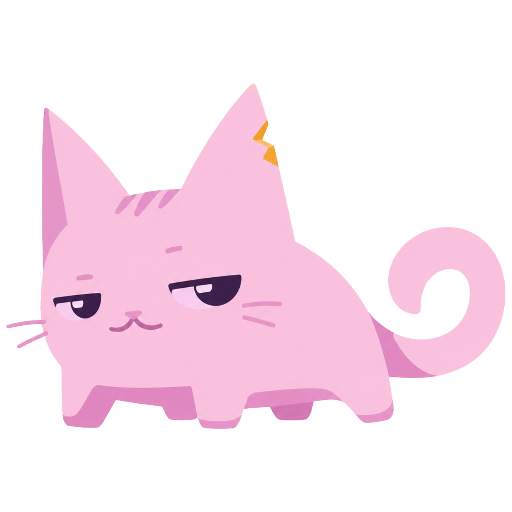
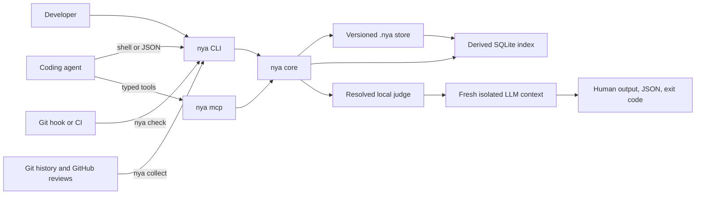

<p align="center">
  
</p>

<h1 align="center">Not You Again</h1>

<p align="center"><strong>A repository-local immune system for coding agents.</strong></p>

<p align="center">
  <a href="#quick-install-with-your-agent">Quick Install</a> |
  <a href="#getting-started">Getting Started</a> |
  <a href="#integrations">Integrations</a> |
  <a href="ARCHITECTURE.md">Architecture</a>
</p>

<p align="center">
  <a href="https://github.com/lucasrgt/not-you-again/actions/workflows/ci.yml"></a>
  <a href="LICENSE"></a>
  
  
</p>

Not You Again gives a Git repository a durable record of mistakes that actually
happened and the corrections that resolved them. Coding agents retrieve the
relevant lessons before changing code and check the finished diff before
declaring a task complete. Existing repositories can recover proven lessons
from Git history and corrected GitHub review comments with one collection run.

The command is `nya`. The versioned repository directory is `.nya/`.

<table>
<tr><td><b>One durable concept</b></td><td>A scar records a real failure and the correction that resolved it. No generic memory types or policy classes.</td></tr>
<tr><td><b>Four focused operations</b></td><td><code>collect</code> existing lessons, <code>recall</code> before editing, <code>remember</code> after a real correction, and <code>check</code> before completion.</td></tr>
<tr><td><b>Repository-owned memory</b></td><td>Readable TOML scars travel through Git with the team. SQLite is only a disposable local search index.</td></tr>
<tr><td><b>Evidence-bounded judgment</b></td><td><code>check</code> may detect only recurrence of supplied scars. <code>collect</code> may record only corrected failures with verbatim source evidence and a second confirmation.</td></tr>
<tr><td><b>Agent and language independent</b></td><td>Any shell or MCP-capable agent can use it in any Git codebase, regardless of programming language.</td></tr>
</table>

---

## Quick install with your agent

Copy this prompt into any coding agent with terminal access:

```text
Set up Not You Again in this Git repository.

Download the latest stable binary for this machine from
https://github.com/lucasrgt/not-you-again/releases and verify its published
checksum. Use no third-party package and do not build from source.

Install `nya` in a user-local PATH location without administrator access or
adding runtime dependencies to the repository. Confirm with `nya --version`.

At the repository root, run `nya init` and preserve existing content. Ensure
the managed Not You Again block is present in the instruction file used by this
harness. If the repository has no recognized instruction file, create only the
appropriate one and rerun `nya init`.

Configure one personal judge matching the available harness with
`nya setup --judge codex`, `nya setup --judge claude`, or
`nya setup --judge hermes`. Ask before choosing if the correct judge is
ambiguous.

If this repository existed before Not You Again, run `nya collect --all`.
Allow its automatic GitHub review scan when `gh` is authenticated. Use
`--offline` only when the user explicitly wants Git-only collection.

Run this setup check:
nya recall --task "Verify Not You Again setup" --path .nya/SKILL.md

Do not commit, push, or modify unrelated files. Report the installed version,
selected judge, changed files, and any action still required.
```

### Manual installation

Download the binary for your operating system and architecture from
[GitHub Releases](https://github.com/lucasrgt/not-you-again/releases), verify
the published checksum, and place `nya` in your `PATH`.

```bash
nya --version
```

---

## Getting started

```bash
# Initialize the repository
nya init

# Select one personal judge
nya setup --judge codex

# Bootstrap a mature repository from Git history and GitHub reviews
nya collect --all

# Retrieve relevant scars before editing
nya recall \
  --task "Build the checkout modal" \
  --path src/checkout/CheckoutModal.tsx

# Record a real corrected failure
nya remember \
  --title "Literal colors bypass semantic design tokens" \
  --lesson "Use semantic design tokens and verify every supported theme." \
  --scope "src/**/*.tsx" \
  --github-review "https://github.com/acme/store/pull/142#discussion_r123" \
  --corrected-by "github:bob" \
  --recorded-by "agent:codex"

# Audit the uncommitted finished diff
nya check --task "Build the checkout modal"
```

### Terminal output

Interactive terminals receive the NYA cat, a live spinner, clear pass and fail
marks, numbered `SCAR n/total` separators for confirmed recurrences, and an
elapsed-time summary. The presentation layer never changes the automation
contract.

| Context | Output |
| --- | --- |
| Interactive terminal | Branded progress and readable findings |
| Redirected output or pipe | Stable plain text without animation or color |
| `--format json` | JSON only |
| `NO_COLOR=1` or `TERM=dumb` | Accessible colorless fallback |

Spinners are written to standard error and cleared before the final result.
This keeps standard output safe for scripts while still showing progress during
long judge calls.

### The flexible task loop

| Moment | Command | Result |
| --- | --- | --- |
| Task start | `nya recall --task "<task>" --path <expected-path>` | Relevant scars become constraints before editing |
| Scope change, context reset, or unfamiliar review | Rerun `nya recall` | The active context is reheated with applicable scars |
| After correcting a real reusable failure | `nya remember` | The lesson and its provenance enter Git |
| Task review or pre-commit | `nya check --task "<completed task>"` | The uncommitted diff is audited against known scars |
| Code review, pull request, or pre-push | `nya check --base <target> --task "<review context>"` | Committed branch work is audited against the selected base |
| Any later useful checkpoint | Rerun `recall` or `check` | NYA can be consulted without depending on one fixed lifecycle |

`recall` and `check` are intentionally repeatable. The minimum protocol is one
recall at task start and one check after the final diff. Run them again when
scope, context, ownership, or the reviewed diff changes.

Plain `nya check` compares the working tree with `HEAD`, including staged,
unstaged, and untracked work. After the work is committed, use `--base` so the
review includes those commits:

```bash
nya check --base origin/main --task "Review the checkout modal branch"
```

A scar is backed by a real failure and a known correction. It is not a
hypothetical risk, generic best practice, preference, design decision, or broad
review suggestion.

`nya collect` is the adoption and maintenance operation around this daily loop.
Run it once with `--all` when enabling NYA in a mature repository. Later runs
scan only commits after the ignored local checkpoint.

The built-in Codex judge needs provider network access. When a task agent runs
inside a network-disabled shell, `nya check` fails fast with exit code 2 instead
of retrying. Delegate that final command to the host, the NYA MCP server, a Git
hook outside the agent sandbox, or CI.

### Repository initialization

`nya init` creates:

```text
.nya/
  .gitignore
  config.toml
  index-v1.sqlite3  # generated FTS and collector checkpoint, always ignored
  SKILL.md
  scars/
```

Commit `.nya/` so every clone receives the same scars and agent protocol.
Initialization is idempotent and preserves human-authored content while adding
a managed block to existing root-level `AGENTS.md`, `CLAUDE.md`, and
`GEMINI.md` files.

---

## How recurrence checking works

```text
real failure
    -> known correction
    -> durable scar
    -> relevant recall
    -> isolated recurrence check
```

`nya check` performs a narrow, fail-closed audit:

1. Resolve staged, unstaged, and untracked changes relative to `HEAD`.
2. Retrieve every scar whose scope matches each changed path.
3. Split scars into batches of 24 and large file diffs into overlapping 80,000-character windows.
4. Cross every applicable scar batch with every matching diff window in a fresh isolated judge process.
5. Accept findings only for supplied scars and concrete changed code.
6. Confirm every proposed finding with a second independent judge call.
7. Return human output, JSON output, and a stable exit code.

### Deterministic coverage, probabilistic judgment

NYA makes the recurrence-checking pipeline deterministic wherever possible,
but semantic judgment still depends on the configured model:

| Deterministic NYA guarantee | Model-dependent judgment |
| --- | --- |
| Select every scar whose scope matches a changed path | Decide whether changed code contradicts the scar's lesson |
| Audit every applicable scar against every diff window | Distinguish a recurrence from code implementing the named remedy |
| Bound individual prompts without silently truncating coverage | Interpret repository-specific intent and incomplete code |
| Validate scar IDs, paths, and verbatim changed-code evidence | Avoid semantic false positives and false negatives |
| Require independent confirmation and fail closed on evaluator failure | Produce consistent verdicts across repeated executions |

Stronger models generally reduce semantic false positives and false negatives.
NYA does not replace model intelligence. It ensures that the configured judge
receives the right scars, the complete relevant diff, and a constrained,
auditable question without accidental omissions. Exhaustive orchestration means
every applicable scar is evaluated, not that every possible model will always
interpret every scar correctly.

Use another comparison base or structured output when needed:

```bash
nya check --base origin/main
nya check --format json
```

### Exit codes

| Code | Meaning | Required action |
| --- | --- | --- |
| `0` | No supplied scar was repeated | Continue |
| `1` | At least one recurrence was confirmed | Fix every finding and rerun |
| `2` | Configuration, repository, runner, timeout, or verdict failure | Treat the audit as failed |

Provider and protocol failures never produce a passing result.

### Findings

Every finding must identify a known scar and concrete evidence in changed code:

```json
{
  "scar_id": "NYA-01J2M6Y7R2W8Y0F7K5Q3C9A1B4",
  "path": "src/checkout/CheckoutModal.tsx",
  "line": 42,
  "evidence": "color: '#fff'",
  "reason": "The changed code repeats the literal-color failure described by this scar."
}
```

The judge has no authority to report generic advice, unrelated bugs, new
preferences, or speculative risks.

---

## Scars and storage

Git is the durable source of truth. Every scar is a readable TOML file under
`.nya/scars/`:

```toml
schema = 1
id = "NYA-01J2M6Y7R2W8Y0F7K5Q3C9A1B4"
title = "Literal colors bypass semantic design tokens"
lesson = """
Use the repository's semantic design tokens instead of literal colors.
Verify every supported theme when correcting the violation.
"""
scope = ["src/**/*.tsx", "src/**/*.ts"]
tags = ["ui", "design-tokens"]
created_at = "2026-07-23T17:42:00Z"

[[occurrences]]
occurred_at = "2026-07-23T16:30:00Z"
source = "https://github.com/acme/store/pull/142#discussion_r123"
reported_by = "github:alice"
corrected_by = "github:bob"
recorded_by = "agent:codex"
recorded_for = "github:bob"
commit = "9e1b7a2"
```

Every scar requires at least one scope. Use the narrowest reusable glob that
describes where the lesson applies:

```toml
scope = ["**/*ViewModel.kt", "**/viewmodels/**"]
```

Use `scope = ["**"]` only when the scar is intentionally repository-wide.
Version 1.0.4 rejects legacy records with a missing or empty scope and names the
invalid scar. Migrate such a record by adding a specific glob, or `**` after
explicitly deciding that the lesson is global.

| Data | Location | Versioned | Purpose |
| --- | --- | --- | --- |
| Scars | `.nya/scars/*.toml` | Yes | Durable team knowledge |
| Shared policy | `.nya/config.toml` | Yes | Repository check behavior |
| Canonical skill | `.nya/SKILL.md` | Yes | Teaches agents when to use `nya` |
| Local judge override | `.nya/config.local.toml` | No | Repository-specific personal selection |
| Search index | `.nya/index-v1.sqlite3` | No | Disposable SQLite FTS5 projection |

Actor identifiers are namespaced strings such as `github:alice`,
`git:bob@example.com`, `agent:codex`, or `ci:github-actions`. Not You Again may
infer a recorder or corrector from the active adapter and Git identity. It
never invents a reporter.

### Recall

Recall is deterministic and does not call an LLM. It combines:

1. Exact scope matches against requested or changed paths.
2. SQLite FTS5 relevance across task, title, lesson, tags, and scope.
3. Independent occurrence count.

Only relevant scars enter the agent context. A missing, corrupt, or incompatible
index is rebuilt automatically, and deleting it never deletes a scar.

### Remember

An exact normalized title match or explicit `--scar <id>` appends an occurrence
to an existing scar. Otherwise, `nya` creates a new scar and requires at least
one `--scope`.

```bash
nya remember \
  --scar NYA-01J2M6Y7R2W8Y0F7K5Q3C9A1B4 \
  --source "https://github.com/acme/store/pull/188#discussion_r456"
```

Fuzzy similarity never merges scars automatically.

#### Corrected GitHub review comments

When a reusable correction came from a line-level GitHub pull request review,
pass its `#discussion_r...` permalink:

```bash
nya remember \
  --title "Cache keys must preserve tenant isolation" \
  --lesson "Include tenant identity in every cache key for tenant-owned data." \
  --scope "src/cache/**" \
  --github-review "https://github.com/acme/store/pull/142#discussion_r123" \
  --corrected-by "github:bob" \
  --recorded-by "agent:codex"
```

`nya` uses the authenticated [GitHub CLI](https://cli.github.com/) to verify
the review comment and records its canonical permalink, author, and creation
time. Install `gh` and run `gh auth login` before using this option. GitHub
Enterprise permalinks are supported through the same `gh` authentication.

The review body is never stored or interpreted as instructions. The developer
or correcting agent must explicitly distill the corrected failure into a
concise title and reusable lesson. `--github-review` cannot be combined with
`--source` or `--reported-by`, so verified and manually asserted provenance
cannot be confused.

### Collect

`nya collect` bootstraps scars from corrections that already exist in a
repository. It mines correction-shaped commits and line-level GitHub review
comments, then requires the isolated model to prove all three parts:

```text
failure signal + actual correction + reusable lesson
```

It does not review the current code for hypothetical defects. Refactors, vague
cleanup, preferences, and unsupported inferences are skipped.

```bash
# First run in a mature repository
nya collect --all

# Incremental run from the ignored local checkpoint
nya collect

# Restrict a migration to commits after one revision
nya collect --since v2.0.0

# Inspect classifications without writing or advancing the checkpoint
nya collect --all --dry-run

# Deliberately collect Git history without querying GitHub
nya collect --all --offline
```

| Classification | Result |
| --- | --- |
| `new` | Create one versioned scar |
| `recurrence` | Append provenance to the matching scar |
| `skip` | Record nothing because the source does not prove a reusable corrected failure |
| `ambiguous` | Record nothing and report the unresolved candidate |

Collection is idempotent by source and correcting commit. Exact-title matches
also append occurrences, so repeated lessons do not create parallel files.
Every proposed write receives a second isolated confirmation. Evidence must be
an exact substring of the supplied commit or review bundle. Human and JSON
output list every confirmed title, source, classification, and target scar when
available, including during `--dry-run`.

GitHub collection auto-detects the `origin` remote and uses authenticated `gh`.
Root review comments are eligible only when their reviewed commit is in local
history and a later commit changed the same path. If a GitHub remote is detected
but `gh` is unavailable, collection fails before writing. `--offline` is the
explicit Git-only escape hatch.

Collector provenance preserves the review author as `reported_by`, the
correcting commit author as `corrected_by`, `nya:collector` as `recorded_by`,
the permalink or commit as `source`, and the correcting commit identifier.

---

## Configuration

### Judge selection

Each developer chooses one isolated evaluator without modifying shared
repository policy. The same selection powers recurrence checks and collection:

```bash
nya setup --judge codex
nya setup --judge claude
nya setup --judge hermes
```

| Scope | Path | Precedence |
| --- | --- | --- |
| Repository-local personal override | `.nya/config.local.toml` | First |
| User configuration on Windows | `%APPDATA%\nya\config.toml` | Second |
| User configuration on macOS | `~/Library/Application Support/nya/config.toml` | Second |
| User configuration on Linux | `$XDG_CONFIG_HOME/nya/config.toml` | Second |

Linux falls back to `~/.config/nya/config.toml` when `$XDG_CONFIG_HOME` is not
set. Use a local override when one repository needs a different judge:

```bash
nya setup --local --judge claude
```

No provider, model, credential, personal judge, or executable belongs in the
committed `.nya/config.toml`.

### Shared policy

```toml
schema = 1

[check]
timeout_seconds = 120
```

### Custom judges

Any provider CLI, local model, or internal gateway can implement the evaluator
protocol:

```bash
nya setup --judge company -- /opt/company/bin/recurrence-judge
```

`nya` executes the argument array without a shell and uses this protocol:

```text
stdin   one UTF-8 NYA task prompt
stdout  one verdict JSON object
stderr  optional diagnostics
exit 0  a parseable verdict was produced
exit !0 runner failure
```

Add `--local` when the custom command applies only to the current repository.

---

## Integrations

| Surface | Role | Required |
| --- | --- | --- |
| CLI | Universal interface for agents, humans, hooks, CI, and scripts | Yes |
| `.nya/SKILL.md` | Teaches historical collection and the daily three-command loop | Created by `nya init` |
| Agent instruction bridge | Activates the skill from existing harness files | Created by `nya init` |
| MCP | Exposes the same core as four typed tools | Optional |
| GitHub | Verifies individual permalinks and collects corrected review comments through `gh` | Optional |
| Git hook | Provides fast local feedback | Optional |
| CI | Enforces the final recurrence gate | Recommended |

### MCP

Start the local stdio server:

```bash
nya mcp
```

It exposes exactly four tools:

```text
nya_remember
nya_recall
nya_check
nya_collect
```

Each tool requires an explicit repository root and calls the same domain
operation as the CLI. The server does not expose generic file, SQL, memory,
prompt, or model tools. Harnesses that launch MCP servers outside their task
sandbox can use `nya_check` as the external recurrence gate.

### Git hooks

An ordinary pre-push hook can compare committed branch work with its target:

```bash
nya check --base origin/main --task "Pre-push branch review"
```

Hooks provide fast feedback but can be bypassed. CI remains the authoritative
enforcement boundary. A hook invoked from a network-disabled task sandbox
delegates the check rather than trying to bypass that sandbox.

### CI

Install a pinned binary, configure an ephemeral judge, and check the pull
request diff:

```bash
export NYA_CONFIG="$RUNNER_TEMP/nya-config.toml"
nya setup --judge codex
nya check --base "$BASE_REF" --format json
```

Provider credentials stay in the CI environment. `NYA_CONFIG` gives the runner
an explicit unversioned configuration path.

---

## Security and privacy

Not You Again is local-first:

1. Scars stay inside the repository.
2. The ignored SQLite index stays inside `.nya/` and contains no unique data.
3. No hosted account or central scar service is required.
4. Judge processes start in a new empty temporary directory.
5. Diff, code, scar, commit, and review content are marked as untrusted data.
6. Malformed output, timeouts, provider errors, and nonzero exits fail closed.

The configured judge may send the bounded audit request to a cloud model. Teams
should choose a runner compatible with their privacy, security, and data
residency requirements. A local model or approved internal gateway can
implement the same protocol.

`nya setup` never asks for credentials. Custom commands should load secrets
from their provider or CI environment rather than command arguments.

---

## Scope

| Not You Again does | Not You Again does not |
| --- | --- |
| Store repository-specific corrected failures | Store general knowledge or preferences |
| Retrieve scars relevant to a task | Copy the entire scar store into every prompt |
| Audit recurrence of known scars | Perform open-ended AI review |
| Work with any language through Git diffs | Replace tests, typecheckers, formatters, or linters |
| Support shell and MCP-capable agents | Require a hosted service or agent harness |

---

## Architecture



CLI and MCP call the same domain operations. No daemon or hosted service is
required. See [ARCHITECTURE.md](ARCHITECTURE.md) for the normative design.

---

## Benchmark

The published synthetic-repository smoke uses paired fresh agents, identical
tasks, hidden evaluators, a pinned model, and the released NYA binary.

| Run | Baseline recurrences | Avoided by NYA | Host gates | Interpretation |
| --- | ---: | ---: | ---: | --- |
| `v0.1.2`, Codex `0.144.0`, `gpt-5.6-sol` | 1 | 1 | 5 of 5 completed | Four baseline cases already passed and provide no prevention evidence |

This is a single smoke run, not a general prevention rate. Read the
[protocol](benchmarks/README.md), [auditable report](benchmarks/results/v0.1.2-codex-gpt-5.6-sol/REPORT.md),
and [machine-readable summary](benchmarks/results/v0.1.2-codex-gpt-5.6-sol/summary.json).

### 10,000 scar production-scale proof

The v1.0.4 benchmark exercises the two dimensions that can otherwise cause
silent omissions: a large scar corpus and a large changed file.

| Corpus | Applicable to one file | Recall | Late large-diff target | Corrected control |
| ---: | ---: | ---: | ---: | ---: |
| 10,000 scars | 1,000 scars | 64 of 64 ranked first | Detected after byte 100,000 | 0 findings |

Recall p95 was 625 ms after the corpus was warm. The first cold read immediately
after creating 10,000 scar files took 58.547 seconds. The exhaustive scale gate
used 169 bounded judge calls, processed 14,355,256 prompt bytes in total, and
kept the largest individual prompt at 96,656 bytes. The deterministic target
was the final applicable scar and appeared after the first 100,000 bytes of a
135,124-byte diff.

Semantic variance was measured separately with paired recurrence and corrected
fixtures for `useMemo`, design tokens, SQL parameterization, and scientific
units:

| Model | Repetitions | Recurrences | Corrected-control findings |
| --- | ---: | ---: | ---: |
| `gpt-5.6-sol` | 2 | 8 of 8 | 0 |
| `gpt-5.3-codex-spark` | 2 | 8 of 8 | 0 |

Read the [protocol](benchmarks/README.md),
[auditable report](benchmarks/results/v1.0.4-production-scale/REPORT.md),
[machine-readable summary](benchmarks/results/v1.0.4-production-scale/summary.json),
and [disclosed development attempts](benchmarks/results/v1.0.4-production-scale/ATTEMPTS.md).

This proves bounded retrieval and complete orchestration at the measured scale.
It does not claim that every possible judge, scar wording, or repository shape
has zero semantic variance.

### 1,024 scar stress proof

The v1.0.3 stress benchmark crosses 64 documented failure families with 16
repository surfaces, then tests bounded recall and exhaustive recurrence
checking across eight domains.

| Corpus | Positive recall | Unrelated recall | Known recurrences | Corrected controls |
| ---: | ---: | ---: | ---: | ---: |
| 1,024 scars | 128 of 128 ranked first | 8 of 8 empty | 16 of 16 detected | 0 of 16 flagged |

The candidate never returned more than the requested 12 recall results. The
v1.0.2 binary returned 128 candidates for the same multi-path request despite a
limit of 12. The v1.0.3 final check audited all 128 scars whose scopes matched
the 16 changed paths, detected every injected recurrence by exact scar ID,
path, and verbatim evidence, and produced no extra findings.

The benchmark includes use of `useMemo`, semantic design tokens, localization,
backend queries, tenant isolation, SSRF, retries, Kubernetes resources,
machine-learning leakage, scientific units, client concurrency, atomic writes,
runbooks, experiments, and accessibility. Read the
[catalog](benchmarks/stress_catalog.json),
[protocol](benchmarks/README.md),
[auditable report](benchmarks/results/v1.0.3-stress-gpt-5.6-sol/REPORT.md),
[machine-readable summary](benchmarks/results/v1.0.3-stress-gpt-5.6-sol/summary.json),
and [disclosed prior attempts](benchmarks/results/v1.0.3-stress-gpt-5.6-sol/ATTEMPTS.md).

This proves known-recurrence retrieval and detection at one corpus size. It
does not estimate a universal prevention rate.

### Persisted scar detection proof

The v1.0.1 detection benchmark tests the narrower product invariant directly.
Five fresh repositories each receive one committed scar followed by a concrete
recurrence in the matching scope. The released NYA binary then runs its real
two-stage `gpt-5.6-sol` judge.

| Persisted scars | Recalled | Blocked with exit 1 | Exact ID, path, and diff evidence |
| ---: | ---: | ---: | ---: |
| 5 | 5 | 5 | 5 |

All five known recurrences were detected and blocked. Read the
[detection report](benchmarks/results/v1.0.1-detection-gpt-5.6-sol/REPORT.md)
and [machine-readable summary](benchmarks/results/v1.0.1-detection-gpt-5.6-sol/summary.json).
This benchmark measures detection of persisted failures, not a general agent
prevention rate.

### Real GitHub review proof

The v0.1.3 workflow starts with a
[real line-level review comment](https://github.com/lucasrgt/nya-github-review-benchmark/pull/1#discussion_r3647349286).
A fresh agent corrected the defect and used the released binary to turn that
exact permalink into a versioned scar. A later paired smoke then measured the
scar in two fresh synthetic tasks.

| Valid pairs | Baseline recurrences | Avoided by NYA | Remaining NYA recurrences |
| ---: | ---: | ---: | ---: |
| 2 | 1 | 1 | 0 |

One baseline already passed and contributes no prevention evidence. A
preliminary read-only sandbox attempt is disclosed and excluded. Read the
[complete report](benchmarks/results/v0.1.3-github-review-gpt-5.6-sol/REPORT.md)
and [machine-readable summary](benchmarks/results/v0.1.3-github-review-gpt-5.6-sol/summary.json).

### Historical collector proof

The v1.0 smoke removed the previously recorded scar from a temporary clone of
the public GitHub review fixture, then asked `nya collect --all` to recover it
from history. The collector found one correction candidate, created one scar
with the exact review permalink and actors, and returned zero candidates on the
next incremental run.

A second `--dry-run` over eight recent AeroFortress Harness revisions found
four corrected failures. Two became proposed new scars and two matched existing
scars as recurrences.

| Run | Sources | Candidates | New | Recurrences | Rejected or ambiguous |
| --- | ---: | ---: | ---: | ---: | ---: |
| Real GitHub review recovery | 7 | 1 | 1 | 0 | 0 |
| Mature harness history | 9 | 4 | 2 | 2 | 0 |

Read the [collector report](benchmarks/results/v1.0.0-collector/REPORT.md) and
[machine-readable summary](benchmarks/results/v1.0.0-collector/summary.json).
This is an auditable smoke, not a universal extraction-rate claim.

---

## Build and contribute

Build the native binary with the stable Rust toolchain:

```bash
cargo build --release
```

The executable is `target/release/nya` or `target/release/nya.exe` on Windows.

Run the project gates:

```bash
cargo fmt --check
cargo clippy --all-targets --all-features -- -D warnings
tokei src
cargo llvm-cov --all-features --fail-under-lines 95
```

| Invariant | Gate |
| --- | --- |
| Maintained runtime code | At most 500 lines |
| Line coverage | At least 95 percent without rounding |
| Product model | One scar and four focused operations |
| Failure behavior | Judge and protocol failures fail closed |
| Transport behavior | CLI and MCP call the same core |

Contributions should preserve the one-scar model, evidence-bounded collection,
the daily three-command protocol, shared core, and fail-closed check.

---

## License

Not You Again is available under the [MIT License](LICENSE).
